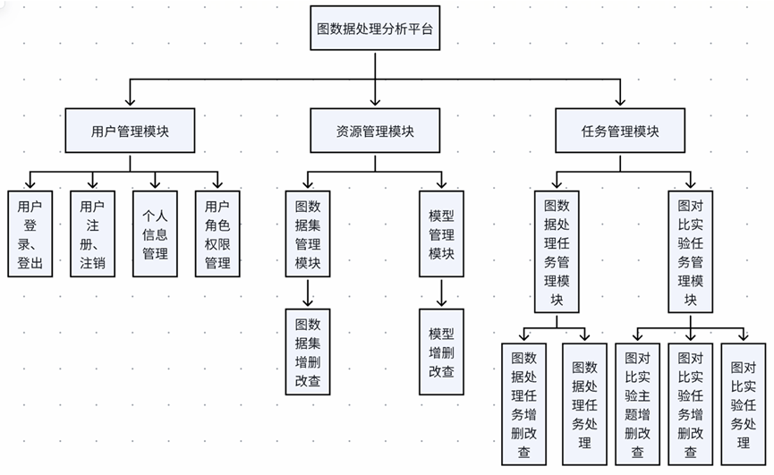
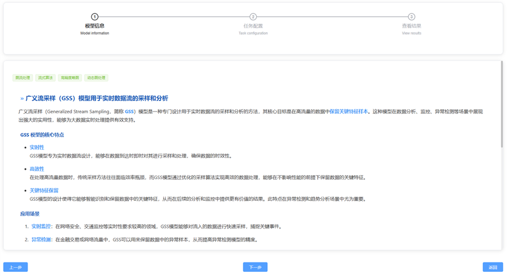
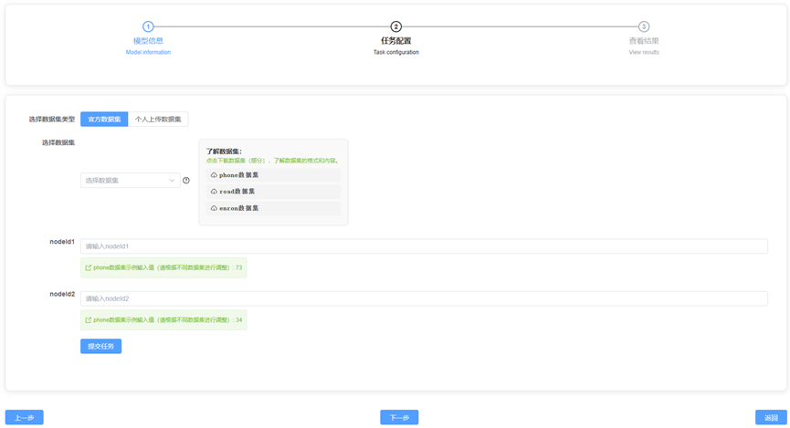
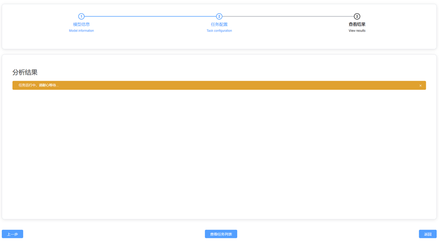
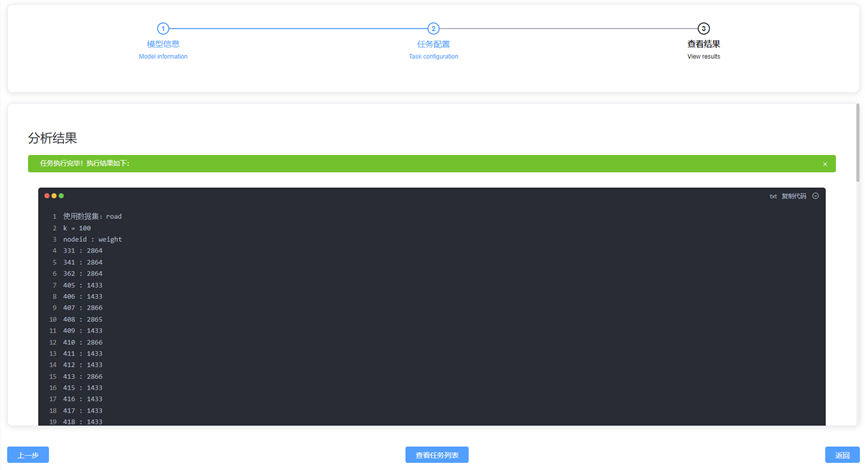
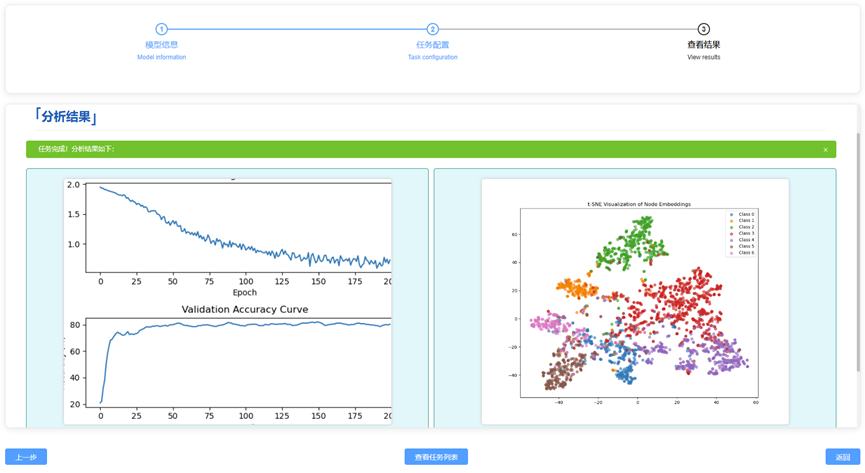
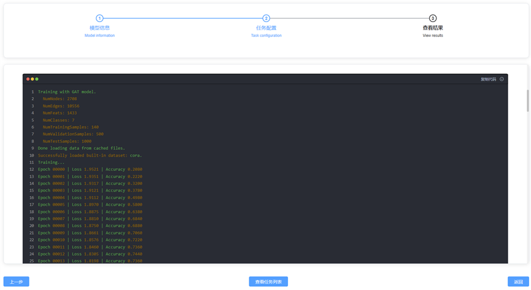

# GraphPrecessor（流模式下大规模图数据处理分析任务平台）

本项目是一个**前后端分离**的图数据处理分析平台，面向“流模式图数据结构/Sketch 类模型”和“非流模式图神经网络（GNN）”两类任务，提供**任务提交、异步执行、结果可视化**与**图对比实验**能力，并包含完善的**用户/权限/资源/任务管理**后台能力。

- **前端**：`graphprocessor-frontend/`（Vue3 + Vite + Element Plus）
- **后端**：`graphprocessor-backend/`（Spring Boot + RuoYi + MyBatis + Redis + RabbitMQ）

---

## 背景与目标（引言）

在大数据时代，**图数据**能够表达复杂系统中实体之间的关联关系（如社交网络、生物信息网络、交通网络等），但随着规模与复杂性提升，如何高效处理与分析大规模图数据成为重要挑战。另一方面，图神经网络等新技术兴起，使得**模型选择与对比**成为常见需求。

本平台旨在提供一套**简单易用**的图数据处理分析服务与图对比实验服务：

- **降低学习成本**：通过直观 UI 与简洁流程，让初学者快速上手不同任务
- **支持多任务与多模型**：覆盖流模式与非流模式（GNN）两类处理范式
- **支持对比实验**：便于用户比较自定义模型与经典模型的效果差异
- **异步任务执行**：引入 RabbitMQ，实现任务异步化，提高吞吐与体验

## 功能概览

### 图数据处理分析

- **面向初学者的任务配置流程**：前端以“模型卡片 + 任务表单”的方式收集参数，提供示例数据集下载、示例输入与快捷填充，降低上手成本。

- **流模式（Streaming）模型**：如 GSS / LGS / LSketch 等  
  - **下游任务示例**：节点度查询、边频次查询、路径可达性、近似子图查询、Top-K/Top-L 频繁项挖掘等  
  - **执行方式**：任务提交后进入队列，后端异步消费任务消息，调用 `g++` 编译/运行模型代码并汇总输出  
  - **结果展示特点**：支持展示目标模型结果，并与 ground truth（若可得）进行对比；同时展示任务执行日志，便于复现与排障

- **非流模式（GNN）模型**：如 GCN / GAT / GraphSAGE 等  
  - **下游任务示例**：节点分类、整图分类、链接预测等  
  - **执行方式**：任务提交后进入队列，后端异步消费任务消息，调用 Python（Conda 环境）执行训练脚本  
  - **结果展示特点**：提供训练曲线、t-SNE 可视化与执行信息（stdout/stderr），并支持将可视化结果上传到对象存储后在前端预览

- **任务状态可视化**：提交后可实时查看任务状态（如：排队/执行中/已完成/失败），并查看失败原因与执行日志。

### 图对比实验

- **主题（Experiment Theme）**：对“需要放在一起对比”的实验进行上层抽象；一个主题下可包含多个实验任务（一对多）。
- **主题描述与文档化**：支持在主题中维护 Markdown 描述（查看 Drawer + Markdown 预览；创建/编辑支持 Markdown 编辑器）。
- **主题详情工作台**（典型）：左侧聚合主题信息、提交记录与曲线对比；右侧提供 Monaco 代码编辑器与控制台辅助。
- **实验提交记录**：可查看每次提交的执行信息与产物，便于追踪对比过程。
- **曲线对比**：支持把多个实验输出曲线放在同一视图中对比（用于分析不同模型/参数设置差异）。

### 用户/权限/资源/任务管理

- **用户管理**：
  - 注册/登录
  - 个人信息维护（头像、密码、简介等）
  - 管理员可管理用户、分配角色权限、必要时可禁用异常账号
- **角色与权限**：
  - 普通用户：可操作个人资源并创建任务
  - 管理员：具备全局管理能力（用户/资源/任务）
  - 封禁用户：会被重定向到 `403` 页面，无法访问系统功能
- **资源管理**：
  - 图数据集管理：上传/删除/修改/查询，用于图数据处理与图对比实验任务
  - 模型管理：维护用户模型代码与官方模型资源，支持预览与复用
- **任务管理**：
  - 图数据处理任务：提交、状态跟踪、结果查看（流模式/非流模式差异化展示）
  - 图对比实验任务：围绕主题创建任务、查看提交记录与对比结果

---

## 运行环境与依赖

### 推荐运行环境（参考配置）

下表来自项目 v1.0 的开发/验证环境，可作为部署参考（不同机器可按需调整）：

| 名称 | 参考配置 |
| --- | --- |
| 操作系统 | Windows 11 |
| CPU | Intel(R) Core(TM) i7-12700 |
| GPU | NVIDIA GeForce RTX 3060 |
| 内存 | 32.0 GB |
| 硬盘 | 100.0 GB |
| Python | 3.9.19 |
| CUDA | 12.6 |
| PyTorch | 2.1.0+cu121 |
| Node.js | 18.20.0（前端建议） |
| MySQL | 8.0.39 |
| RabbitMQ | 3.12.0 |
| Redis | 6.0 |
| Java | 1.8 |
| gcc/g++ | 8.1.0 |

### 必选依赖

- **Java**：JDK 8（后端）
- **Maven**：3.6+（后端构建）
- **Node.js**：建议 18+（前端）
- **MySQL**：8.x（后端数据存储）
- **Redis**：6.x（缓存、登录态等）
- **RabbitMQ**：3.x（任务异步执行）

### 任务执行相关（按需）

- **流模式任务**：需要 `g++`（用于编译/运行 C++ 模型代码）
- **非流模式任务（GNN）**：需要 Python/Conda 环境（用于执行训练脚本）
  - 具体 Python 解释器路径由后端配置 `paths.conda_python_exe` 指定
  - 若需要 GPU：CUDA / PyTorch 等按你本地环境安装即可（与平台本身解耦）

> 注意：后端配置文件中包含一些**本机绝对路径**（例如数据集/输出目录/Conda Python 路径），不同机器需要自行修改为本机路径（见下文“配置说明”）。

---

## 系统模块设计

系统可划分为 **用户管理、资源管理、任务管理** 三大模块：

- **用户管理模块**：用户/角色/权限管理
- **资源管理模块**：图数据集管理、模型管理
- **任务管理模块**：图数据处理任务管理、图对比实验任务管理、图对比实验主题管理



---

## 系统功能介绍（详细）

本节把 `参考文档.md` 的功能介绍“落地为 README 可读版本”，并为每个关键页面预留截图路径。

### 4.1 核心功能

#### 4.1.1 图数据处理功能

平台向用户提供“系统内置模型 + 对应下游任务”，用户可用较低学习成本处理**官方数据集**或**个人上传数据**。

- **模型与任务覆盖**：
  - **流模式模型**：GSS / LGS / LSketch 等  
    - 下游任务：节点度查询、边频次查询、路径可达性查询、近似子图查询、Top-K 频繁项挖掘、Top-L 条件频繁项挖掘等
  - **非流模式（GNN）模型**：GCN / GAT / GraphSAGE 等  
    - 下游任务：节点分类、整图分类、链接预测等

- **交互流程与页面**：
  - **模型列表（卡片展示）**：用户在卡片中选择模型与下游任务  
    

  - **模型详情页**：展示模型详细信息  
    

  - **任务配置表单**：收集任务参数；提供示例数据集下载、示例输入与快捷输入  
    

  - **任务状态**：提交后可实时查看任务状态变化  
    


- **结果展示差异**：
  - **流模式任务结果**：展示目标模型结果，并与 ground truth 对比  
    

  - **非流模式任务结果**：展示训练曲线、t-SNE 可视化与任务执行信息  
    

    


#### 4.1.2 图对比实验功能

部分对比实验需要“放在一起”对比，因此平台在图对比实验任务上层抽象出 **图对比实验主题**，主题与任务是一对多关系。

- **主题详情工作台**：
  - 左侧：主题描述信息、提交记录、曲线对比等
  - 右侧：Monaco 代码编辑器（编辑模型代码）+ 控制台（标记任务、选择个人数据集与模型等）

### 4.2 用户管理模块

用户账号管理是平台体验起点，也是系统安全与合规的重要组成：

- **注册**：创建新账号，默认角色为普通用户
- **登录**：按角色权限自动跳转  
  - 普通用户：进入主界面（基础功能：资源管理、任务创建等）  
  - 管理员：进入管理后台（全局管理用户/资源/任务）  
  - 封禁用户：重定向到 `403` 权限不足页面
- **个性化设置**：修改密码、更新头像、调整个人简介等
- **管理员能力**：分配角色权限、禁用异常账号等

### 4.3 资源管理模块

平台需要管理的主要资源为 **图数据集** 与 **模型代码**。两者均作为图数据处理任务与图对比实验任务的输入内容，核心需求是“便于管理与复用”，因此提供基础的增删改查能力。

### 4.4 任务管理模块

平台提供两大核心服务：**图数据处理分析** 与 **图对比实验**，对应两类任务管理模块。  
其中图对比实验为了跨任务对比结果，额外引入 **图对比实验主题** 管理模块（主题与任务一对多）。

---

## 快速开始（开发模式）

### 1）准备基础服务

- 启动 **MySQL / Redis / RabbitMQ**
- 创建数据库（默认示例库名为 `ry-vue`，可自行修改）

### 2）初始化数据库

SQL 脚本位于：`graphprocessor-backend/sql/`

建议初始化顺序（典型）：

1. `ry_20240629.sql`（若依基础表与初始化数据）
2. `quartz.sql`（定时任务相关表）
3. `official.sql`、`comparsion.sql`、`theme.sql`、`user.sql`（平台业务表/示例数据，按需）

> 具体是否需要全部脚本取决于你启用的平台功能；若缺表会在后端启动或接口调用时报错。

### 3）启动后端

后端目录：`graphprocessor-backend/`

常见启动方式：

- **IDEA**：运行 `graphprocessor-backend/ruoyi-admin/src/main/java/com/ruoyi/RuoYiApplication.java`
- **命令行**：在 `graphprocessor-backend/` 下执行 Maven 构建并运行（按你的习惯）

默认端口与前缀（可在配置中修改）：

- 后端端口：`8080`
- Swagger 前缀：`/dev-api`（用于与前端代理保持一致）

> 后端启动时会自动调用 `MqInitMain.init()` 初始化 RabbitMQ 的交换机/队列，因此 **RabbitMQ 必须先启动**。

### 4）启动前端

前端目录：`graphprocessor-frontend/`

推荐使用 `pnpm`（仓库包含 `pnpm-lock.yaml`）：

```bash
pnpm install
pnpm dev
```

默认前端开发端口：

- `http://localhost:80`

开发代理（前端 -> 后端）：

- 前端以 `/dev-api` 作为接口前缀，Vite 会把 `/dev-api/**` 代理到 `http://localhost:8080`

---

## 配置说明（你很可能需要改）

### 后端配置

主要配置文件：

- `graphprocessor-backend/ruoyi-admin/src/main/resources/application.yml`
- `graphprocessor-backend/ruoyi-admin/src/main/resources/application-druid.yml`

你通常需要关注：

- **数据库连接**：`application-druid.yml` 中 `spring.datasource.druid.master.url/username/password`
- **本机路径**：`application.yml` 中 `ruoyi.profile`、`paths.*`（数据集存储、输出文件、代码沙箱目录、Conda Python 等）
- **Redis**：`spring.redis.*`
- **RabbitMQ**：本项目默认连接本机 RabbitMQ（`localhost`），使用默认端口/账号（若你修改了 RabbitMQ 账号密码，需要同步配置 Spring AMQP）
- **对象存储（COS）/邮件**：如不使用，请自行关闭或改为自己的配置（避免把敏感信息提交到仓库）

> 安全提示：请不要在公共仓库提交真实的邮箱口令、对象存储密钥等敏感信息。建议通过环境变量或本地配置覆盖。

### 前端配置

前端通过 Vite 环境变量读取：

- `VITE_APP_BASE_API`：接口前缀（开发建议 `/dev-api`）
- `VITE_APP_TITLE`：页面标题（可选）

由于仓库规则可能阻止提交 `.env*`，本项目提供示例文件：

- `graphprocessor-frontend/env.development.example`
- `graphprocessor-frontend/env.production.example`

你可以在本地复制为 `.env.development` / `.env.production` 后按需修改（尤其是 `VITE_APP_BASE_API`）。

---

## 默认账号

若使用若依初始化数据，通常可使用：

- 管理员：`admin / admin123`

（具体以你导入的 SQL 初始化数据为准）

---

## 目录结构（简要）

```text
GraphPrecessor/
  README.md
  参考文档.md
  graphprocessor-frontend/          # Vue3 + Vite 前端
  graphprocessor-backend/           # Spring Boot + RuoYi 后端
    sql/                            # 初始化 SQL
    ruoyi-admin/                    # 后端启动入口
    ruoyi-graphprocesser/           # 图数据处理/图对比实验业务模块（含 RabbitMQ 消费者）
```

---

## 常见问题（FAQ）

### 1）前端接口 404 / Network Error

- 确认前端 `VITE_APP_BASE_API` 为 `/dev-api`
- 确认 Vite 代理开启（`graphprocessor-frontend/vite.config.js`）
- 确认后端已启动且端口为 `8080`

### 2）后端启动报数据库连接失败

- 确认 MySQL 已启动、库已创建、并已导入 SQL
- 修改 `application-druid.yml` 的连接信息为你的本机账号密码

### 3）任务一直不执行 / 无消费者

- 确认 RabbitMQ 已启动
- 后端启动日志应出现“初始化消息队列完成”
- 确认机器具备任务执行依赖：流模式需要 `g++`，非流模式需要可用的 Conda Python

---

## LICENSE

本仓库包含若依（RuoYi）相关代码，授权与第三方依赖请以各子目录 `LICENSE` / 依赖声明为准。


